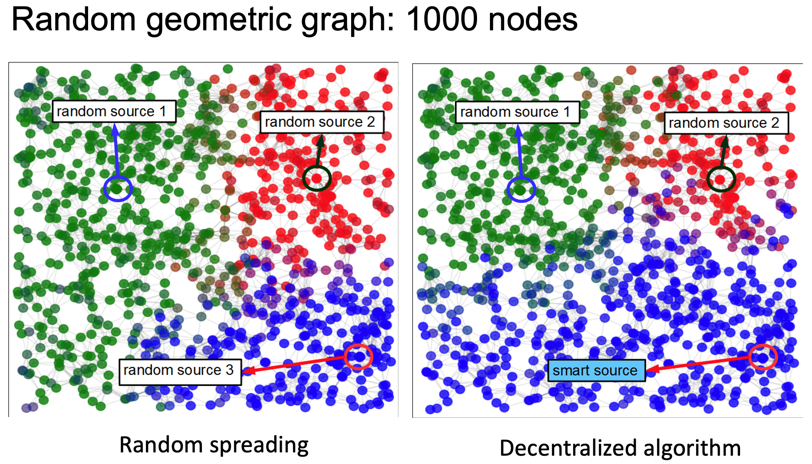
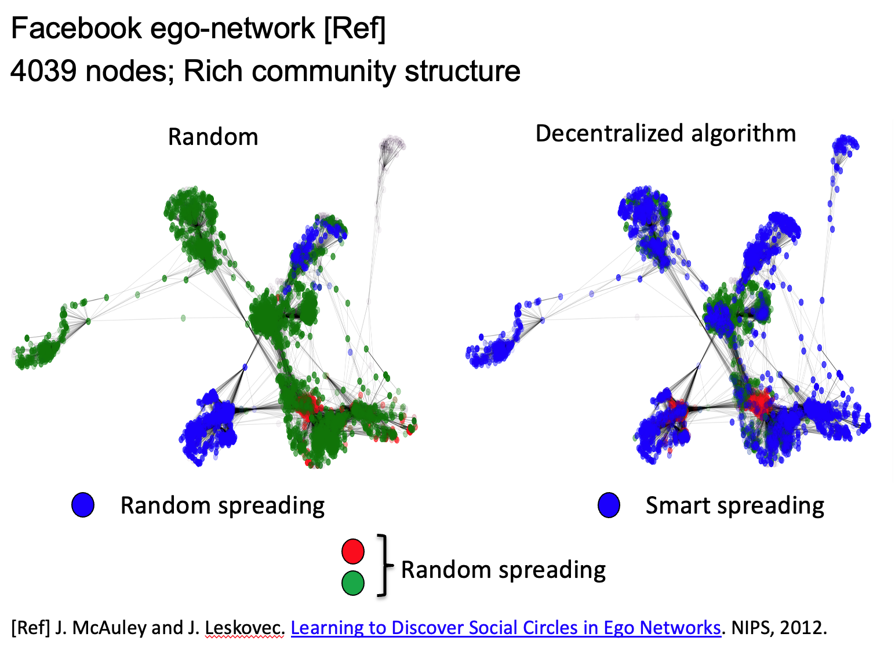

# Smart Information Spreading for Opinion Maximization in Social Networks.

This repository is based on the paper - [Smart Information Spreading for Opinion Maximization in Social Networks](https://ieeexplore.ieee.org/document/8737538). 

ArXiv version: [https://arxiv.org/pdf/1901.00209](https://arxiv.org/pdf/1901.00209)

## TL;DR:

This paper introduces a novel approach to opinion maximization in social networks by leveraging smart information spreading instead of simply identifying influential nodes. Using a dynamic Bayesian network (DBN), the problem is framed as a sequential decision process, where one source injects information strategically and others randomly. The study develops centralized and decentralized versions of Q-learning algorithms to approximate solutions and, through simulations, shows that smart spreading significantly outperforms random spreading, even when placed at a disadvantageous position in the network. 

## Notebook: [Qopin.ipynb](Qopin.ipynb) 

## Installation

### Clone the repository:
```sh
git clone https://github.com/nayakanuj/Smart_Info_Spreading.git
```

### Navigate to the project directory:
```sh
cd Smart_Info_Spreading
```

### Install the required dependencies:
```sh
pip install -r requirements.txt
```

## Usage
To run the main script, use the following command:
```sh
python qopin_wrapper.py
```

## Results

*Comparison between smart and random information spreading in random geometric graph. Smart information spreading is based on a decentralized version of Q-learning.*


*Comparison between smart and random information spreading in Facebook Ego network [[Ref](https://snap.stanford.edu/data/egonets-Facebook.html)]. Decentralized version of Q-learning algorithm for smart information spreading performs well particularly in clustered graphs.*

If found useful, please cite as:
```sh
@inproceedings{nayak2019smart,
  title={Smart information spreading for opinion maximization in social networks},
  author={Nayak, Anuj and Hosseinalipour, Seyyedali and Dai, Huaiyu},
  booktitle={IEEE INFOCOM 2019-IEEE Conference on Computer Communications},
  pages={2251--2259},
  year={2019},
  organization={IEEE}
}
```
